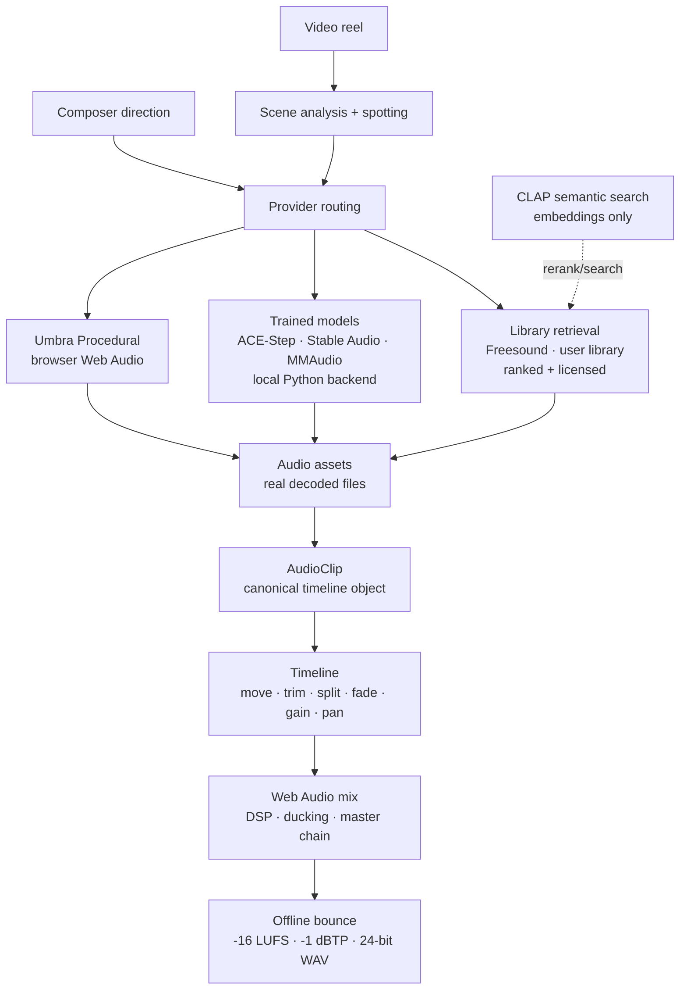

# Architecture overview

UMBRA·SCORE is a **hybrid browser + local-Python workstation** for horror
scoring and sound design. The browser owns interaction and all audible
rendering; a local Python service owns heavy ML inference. Every sound source
— synthesized, generated, or retrieved — lands on one timeline as one kind of
object (`AudioClip`) and renders through one master chain.

## System diagram



ASCII fallback (same flow):

```
VIDEO + USER DIRECTION
        │
        ▼
  SCENE / SPOTTING
        │
        ▼
  PROVIDER ROUTING
        │
  ┌─────┼──────────────┐
  ▼     ▼              ▼
PROC    ML           LIBRARY
  │     │              │
  └─────┴──────┬───────┘
               ▼
          AUDIO ASSETS
               │
               ▼
           AUDIOCLIP
               │
               ▼
            TIMELINE
               │
               ▼
         WEB AUDIO / DSP
               │
               ▼
             EXPORT
```

## Subsystem boundaries

| Subsystem | Location | Owns | Must never own |
| --- | --- | --- | --- |
| Browser application | `src/` | UI, timeline, transport, clip editing, Web Audio playback, procedural synthesis, mixing, DSP, metering, offline render, library UX, project state | Heavy ML inference, model weights, latent tensors |
| Python backend | `backend/` | Model loading, inference, CLAP embeddings, scene detection, audio file store, generation jobs, video preprocessing | Timeline, playback, UI, persistence of project state |
| External / local sound sources | Freesound API, user disk, IndexedDB cache | Recorded sound with provider metadata | Generation (they are *found*, not synthesized) |
| Project domain | `src/lib/types.ts`, `src/lib/library/types.ts`, `backend/providers/base.py` | Canonical concepts: Project, Scene, AudioClip, Provider, RetrievalIntent, Transform, Provenance | Rendering, inference, transport |

Details: `FRONTEND.md`, `BACKEND.md`, `AUDIO_PIPELINE.md`, `PROVIDERS.md`,
`PROJECT_MODEL.md`.

## Key design decisions (summary)

- **Hybrid, not browser-only, not cloud:** PyTorch models cannot run in a
  browser; a composer's reference audio must not leave their machine. So:
  browser Web Audio + local Python service. Full rationale: `../decisions/ADR-0001-hybrid-browser-python-architecture.md`.
- **One canonical clip:** every source becomes an `AudioClip`. Rationale:
  `../decisions/ADR-0002-unified-audio-clip-model.md`.
- **Procedural is first-class:** deterministic, frame-accurate synthesis next
  to (not beneath) generative models. Rationale:
  `../decisions/ADR-0003-procedural-engine-first-class.md`.
- **Retrieval keeps provenance:** license and credit survive to export.
  Rationale: `../decisions/ADR-0004-library-retrieval-and-provenance.md`.

## Repository map

```
/                                public entry point: README, AGENTS.md, CONTRIBUTING.md
├── src/                         browser application (React + Web Audio)
│   ├── App.tsx                  shell: rail navigation, view switching
│   ├── main.tsx                 entry point
│   ├── components/              views: timeline, inspector, library, models, scoring…
│   └── lib/                     engines + state + domain types
│       ├── audio.ts             realtime monitor engine (ScoreEngine)
│       ├── clips.ts             clip decode cache + Web Audio scheduling primitives
│       ├── render.ts            offline bounce + 24-bit WAV export
│       ├── dsp.ts               shared DSP: strips, convolvers, master chain
│       ├── voices.ts            17 procedural synthesis voice classes
│       ├── proceduralClip.ts    procedural → bounced-WAV clip bridge
│       ├── types.ts             CANONICAL frontend domain types (AudioClip…)
│       ├── providers.ts         typed backend client (the ONLY frontend↔backend boundary)
│       ├── generate.ts          deterministic scene/layer planning
│       ├── useGeneration.ts     backend status polling, job tracking
│       ├── useStudio.ts         project state, transport, editing, export
│       └── library/             retrieval: planner, ranking, Freesound/Pixabay/
│                                user-library, IndexedDB cache, provenance, credits
├── backend/                     local ML service (FastAPI)
│   ├── app.py                   all /api routes, unified schemas
│   ├── providers/               provider contract, registry/router, one file per model
│   ├── analysis/                scenes, spotting prompts, video, waveform, embeddings
│   ├── services/                audio store, devices, jobs, model discovery
│   └── tests/                   backend honesty + real-audio contract tests
├── tests/                       frontend tests (retrieval acceptance + architecture invariants)
├── scripts/                     run_backend, setup_models, verify_environment
├── docs/                        this documentation system
├── .github/                     CI, PR and issue templates
├── index.html                   Vite shell (untouched)
├── package.json                 npm scripts incl. `verify`
├── THIRD_PARTY_LICENSES.md      software licences (verified upstream)
└── THIRD_PARTY_MODELS.md        model weight licences + gating
```

One sentence per directory — if a file does not fit its directory's sentence,
the file is in the wrong place.
